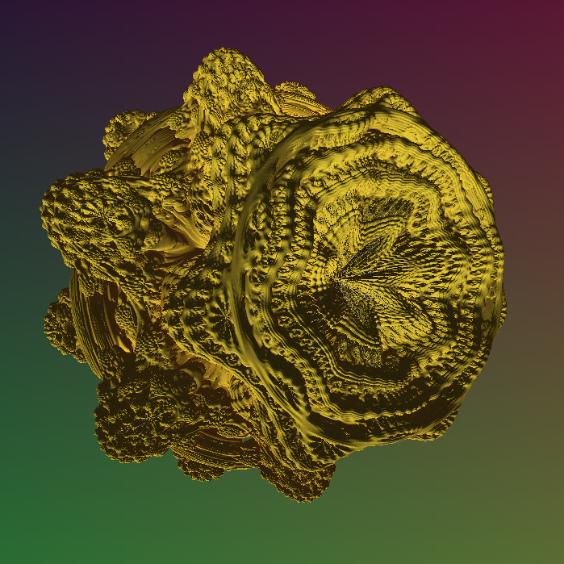

# Fractal visualization in Vulkan

[](https://github.com/m-torhan/vk-fractal/actions/workflows/build.yml)
[](https://github.com/m-torhan/vk-fractal/actions/workflows/pre-commit.yml)



## Build

```bash
cmake -S . -B build -DCMAKE_BUILD_TYPE=Release -G Ninja
cmake --build build -j $(nproc)
```

## Run

```bash
./build/vk_fractal
```

### Controls

- Mouse - look around
- WASD - move
- QE - roll
- ZX - next/prev fractal
  - 0 - debug ball
  - 1 - debug box
  - 2 - Mandelbulb
  - 3 - Mandelbox
